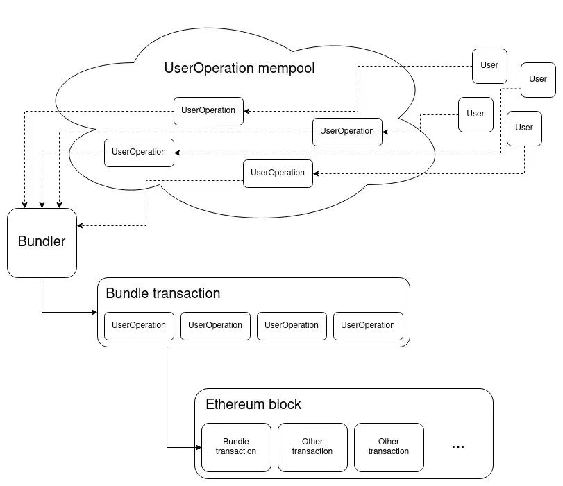

# ERC4337 : Account abstraction using alternative mempool

A brief guide about account abstraction.

# What is ERC-4337 ?

The main goal of the ERC 4337 is to use smart contract wallets without any changes to the protocol. Currently, A user can interact with the protocol  or initiate the transaction using EOA ( externally owned accounts) which are generated using private keys. So, the security of the user funds are compromised if user lost his private key. User assets are directly relayed on the private key of the account. The Goal of account abstraction is to provide the smart contracts to initiate transaction themselves without relaying on the private keys and implementing their arbitrary verification logic .

# What are the advantages of the account abstraction ?

- **Batching the transactions :** More than one transaction can be batched in one transaction reducing the gas fee and also improving user experience.
    
- **Implement Wallet** logic: we can implement arbitrary wallet logic , by using delegateCall() we can upgrade the wallet logic .
    
- **Quantum safe :** By implementing the smart contract wallets we can make the external layer a quantum-safe
    
- **PayMasters :** User can pay using ERC-20 tokens , paymasters are the intermediate contracts which pay gas fee behalf of the user.
    
- **Implementing MultiSig Wallets :** we can implement multisig wallets so large transactions need multiple approvals from the owner of the contract.
    

# **Architecture of ERC-4337**

## **Overview**

- **userOperation** : User send the transaction in form of objects called userOperation . It contains various fields , containing different data that are needed to execute the transaction and include it in the block.
- **MemPool** : This transactions are sent to separate mempool , that is different from public mempool .Where bundlers will listen for the transactions.
- **Bundlers** : There are multiple bundlers where they listen to the transactions , these bundlers either a individual or node operator.They select multiple transaction , in same way as public mempool , and bundle them into single transaction and sent to the entry point contract.
- **Entry Point contracts** : These are predeployed singleton contract which is used to execute the transaction .
- **PayMasters** : This gas providers , users can pay gas fee in ERC-20 tokens via paymasters , they pay gas fee behalf of the user



***Credits*** :[https://notes.ethereum.org/@vbuterin/account\_abstraction\_roadmap#Convert-an-EOA-into-a-smart-contract-wallet](https://notes.ethereum.org/@vbuterin/account_abstraction_roadmap#Convert-an-EOA-into-a-smart-contract-wallet "ERC 4337 notes")

## userOperation :

- It is a special data structure which is used to send the details of the transaction , unlike the regular transactions , it contains following fields of data fields ;
    - - **sender** : (address) Wallet that making the operation
            **nonce** :(uint256) anti replay parameter , also used as salt for first transaction
            **initcode** :(bytes) init code of the wallet , if it is the first transaction it is utilitzed to create a contract with this init code
            **callData:**(bytes) call data that is sent to the sender wallet
            **callGas:**(uint256) the amount of gas for the main execution
            **verificationGas:**(uint256) the amount of gas for verification purpose
            **preVerificationGas:**(uint256) the amount of gas to be paid for bundlers for pre verification process
            **maxFeePerGas**: (uint256) this is same as EIP-1559 , maximum amount of gas willing to pay for the transaction by the user
            **maxPriorityFeePerGas:**(uint256) this same as EIP-1559
            **paymaster:**(address) address of sponsor of  transaction , 0 if it is self-sponsoriing
            **paymasterData:**(bytes) extra data that is sent to the transaction
            **signature :**(bytes) Data is passed to the wallet for the verification purpose

### After wards :

Users creates the userOperations and sent to the Mempool that is only dedicated for userOperations. Bundlers actively listening for the transaction and they bundle the multiple transactions and sent it the entry point contract .

## Entry Point contract :

It is predeployed smart contract that is used to execute this transaction send by the bundlers.

It is depolyed at address :0x0000000071727De22E5E9d8BAf0edAc6f37da032

### [ERC-4337 entry point contract](https://etherscan.io/address/0x0000000071727de22e5e9d8baf0edac6f37da032#code)

### Functionality :

### Interface for entry point contract :

```
function handleOps

(UserOperation\[\] calldata ops, address payable redeemer)

external;

function simulateWalletValidation

(UserOperation calldata userOp)

external returns (uint gasUsedByPayForSelfOp);

function simulatePaymasterValidation

(UserOperation calldata userOp, uint gasUsedByPayForSelfOp)

external view returns (bytes memory context, uint gasUsedByPayForOp);

Wallet should implement the following Function to verify the authenticity of the sender 

function validateUserOp

(UserOperation calldata userOp, uint requiredPrefund)

external;
```

- The handleOps function handles all the userOperations . It iterates two loops one for verification phase and another for execution phase
- In first phase , it create a wallet if it is not there and call ValidateUserOp in wallet contract to validate the sender of the transaction .
- In secound phase , send the calldata to the wallet contract

## PayMasters

- User can pay their gas fee using an ERC-20 via paymasters , they pay gas behalf of the user for that transaction .
- The entry Point contract calls

```
function validatePaymasterUserOp
    (UserOperation calldata userOp, uint maxcost)
    external view returns (bytes memory context);
```

on the Paymaster contract in verification loop so that paymaster has enough ETH and willing to pay for the user transaction.

# Conclusion

ERC-4337 has tremendous potential to change the way we interact with Ethereum . We can implement our own wallet logics and also we can update our logic by using upgradability of the contracts.

- It increases the user experience and mass adoption from web2
-  We can pay gas with ERC-20 via paymasters
- It reduces gas fee by batching up multiple transactions into one transaction 

And atlast there is huge scope for dapp developers to innovate the things upon ERC-4337 , huge financial scope for paymasters.

There is seamlessly integrate any Web3 games that can store the state of a player in simple manner , without making multiple calls to update the state , they can all batch upon one transaction.